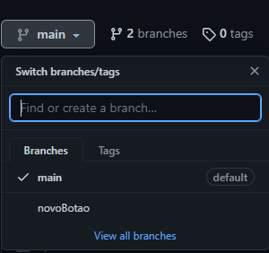

<!--

# -> Título
## -> Subtítulo
* -> Tópico
** ** -> Deixar em negrito
` ` -> destacar um código

-->

# Tutorial de Git e Github na prática

## Instalação do Git
* [Link](https://git-scm.com/downloads) 
  
## Versionamento local do projeto
* Acesse a pasta na qual o projeto está armazenado
* Clique com o botão direito do mouse e selecione **Open Git Bash here**
* Digite `git init` para inicializar o repositório
  
  Será criada uma pasta chamada `.git`, **não** a apague
* Digite `git add .` para colocar os arquivos do projeto na **área de staging**  
  

  

* Digite `git commit -m "primeira versão do projeto"` para versionar **localmente** o projeto
* Digite `git branch -M "main"` para renomear a branch principal de `master` para `main`

## Criação de um repositório no Github
* Acesse a sua conta do Github e clique em `New` para criar um novo repositório
  
  Coloque um nome para o repositório e preencha as informações do projeto, como a descrição
* Para enviar o commit do repositório local (isto é, em sua máquina) para um repositório na  
  plataforma do Github, digite por linha de comando `git remote add origin <link do repositório>`

  `origin` é o nome utilizado para referenciar o link do repositório remoto

* Dessa forma, o repositório local já está vinculado ao repositório remoto do Github, entretanto  
  a versão (isto é, o commit) não sobe automaticamente, por isso é necessário digitar: **`git push -u origin main`**
* Por fim, recarregue a página do Github e verefique se o projeto foi versionamente **remotamente**

## E quando o projeto for alterado? 

* Ao digitar um arquivo já versionado ou mesmo criar um novo arquivo que não existia na versão  
  anterior, **NÃO** é necessário inicializar novamento o Git por meio do comando `git init`, sendo  
  assim execute os seguintes comando em ordem:  
  `git add .`

  `git status` para verificar os arquivos que estejam aguardando na stanging area

  `git commit -m "<escreva uma mensagem detalhando o que foi alterado>`

  `git push `

  Como pe possível notar, também **NÃO** é necessário renomear mais uma vez a branch (pois
  ela já estará renomeada como `main`),  
  além disso, o link do repositório remoto já estará armazenado, por isso o comando `git remote add origin <link do repositório>`       
  só é utilizado uma única vez

* No Github será possível verficar todas as versões enviadas clicando em `commits`, de modo  
  que todas as alterações feitas estarão demonstradas

  O sinal verde `+` representa o que foi adicionado/modificado no versionamento, enquanto o sinal vermelho  
  `-` representa o que foi excluído de um versão para outra

## Branch

* Até então, todos os versionamentos ocorreram na **ramificação principal (branch `main`)**
* Para criar uma nova branch , isto é, uma nova linha cronológica adicional/alternativa à  
  principal que possa posteriormente se juntar à `main`, digite `git checkout -b <nome da nova branch>`,  
  assim o terminal Git sairá da branch `main`, criará uma nova como nome que desejar e entrará nela,  
  por exemplo: `git checkout -b novoBotao`  
* Com uma nova branch criada, utilize os comando já explicados:  
  `git add .`

  `git status` 

  `git commit -m "<escreva uma mensagem>`

  `git push -u origin novoBotao `

* No Github, as branches aparecerão assim:

  

* Se necessário retornar para branch `main` pelo terminal do Git, digite `git checkout main`

## Merge

* Ao retornar para a branch `main`, digite `gir merge <nome da nova branch>` (no exemplo acima, seria a branch chamada novoBotao),   
 desse modo será possível **unificar a branch alternativa e a principal em uma só**

* Desse modo, tudo o que tinha de alteração na branch novoBotao (por exemplo) se juntará à branch `main`

* Para finalizar digite `git push origin main` e suba os arquivos para a branch principal do repositório remoto